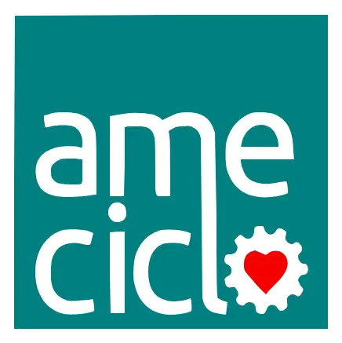

# 🚴 Ameciclo - Plataforma de Dados de Mobilidade Ativa

<div align="center">
  
  
  ### Associação Metropolitana de Ciclistas do Recife
  
  [](https://nodejs.org/)
  [](https://remix.run/)
  [](https://www.typescriptlang.org/)
  [](LICENSE)
</div>

---

## 📋 Sobre o Projeto

A **Plataforma Ameciclo** é uma aplicação web full-stack que centraliza e visualiza dados abertos sobre mobilidade ativa na Região Metropolitana do Recife. Desenvolvida com tecnologias modernas, oferece ferramentas interativas para estudantes, jornalistas, pesquisadores, cicloativistas e cidadãos interessados em uma cidade mais humana, democrática e sustentável.

### 🎯 Principais Funcionalidades

- **📊 Observatórios Especializados**: Ideciclo, Sinistros Fatais, Vias Inseguras, SAMU, CicloDados
- **🗺️ Visualizações Interativas**: Mapas (Mapbox), gráficos (Highcharts), tabelas dinâmicas
- **📈 Contagens de Ciclistas**: Dados históricos com análises comparativas
- **📚 Biciclopédia**: FAQ sobre mobilidade ativa
- **📁 Documentos Públicos**: Acesso a relatórios e estudos
- **🎨 Acessibilidade**: Controles WCAG (tamanho de fonte, alto contraste, dark mode)

---

## 🛠️ Stack Tecnológica

### Core
- **[Remix](https://remix.run/)** 2.16 - Framework full-stack com SSR
- **[React](https://react.dev/)** 18.2 - Biblioteca UI
- **[TypeScript](https://www.typescriptlang.org/)** 5.1 - Tipagem estática
- **[Vite](https://vitejs.dev/)** 5.1 - Build tool

### UI & Styling
- **[Tailwind CSS](https://tailwindcss.com/)** 3.4 - Framework CSS utility-first
- **[Framer Motion](https://www.framer.com/motion/)** - Animações
- **[Lucide React](https://lucide.dev/)** - Ícones

### Visualização de Dados
- **[Highcharts](https://www.highcharts.com/)** - Gráficos interativos
- **[Mapbox GL](https://www.mapbox.com/)** - Mapas interativos
- **[FullCalendar](https://fullcalendar.io/)** - Calendário de eventos

### Gerenciamento de Estado
- **[TanStack Query](https://tanstack.com/query)** - Cache e sincronização
- **React Context API** - Estado global

---

## 🚀 Como Rodar o Projeto

### ⚠️ Requisitos Obrigatórios

> **IMPORTANTE**: Certifique-se de ter as versões corretas instaladas antes de prosseguir.

- **Node.js** >= 20.0.0 ([Download](https://nodejs.org/))
- **npm** >= 10.0.0 (incluído com Node.js)
- **Git** ([Download](https://git-scm.com/))

### 📦 Instalação

```bash
# 1. Clone o repositório
git clone https://github.com/Ameciclo/ameciclo.git
cd ameciclo

# 2. Instale as dependências
npm install

# 3. Configure as variáveis de ambiente (opcional)
cp .env.example .env
# Edite o arquivo .env com suas credenciais

# 4. Inicie o servidor de desenvolvimento
npm run dev
```

O projeto estará disponível em: **http://localhost:5173**

### 🔧 Scripts Disponíveis

```bash
npm run dev        # Inicia servidor de desenvolvimento
npm run build      # Gera build de produção
npm start          # Inicia servidor de produção
npm run lint       # Verifica qualidade do código
npm run typecheck  # Verifica tipos TypeScript
```

---

## 📁 Estrutura do Projeto

```
ameciclo/
├── app/
│   ├── components/      # 182+ componentes React
│   │   ├── Commom/      # Componentes globais
│   │   ├── CicloDados/  # Plataforma colaborativa
│   │   ├── ViasInseguras/ # Análise de vias
│   │   └── ...
│   ├── routes/          # 27 rotas (file-based routing)
│   ├── loader/          # Loaders para SSR
│   ├── services/        # Lógica de negócio e APIs
│   ├── contexts/        # React Context
│   ├── hooks/           # Custom hooks
│   └── utils/           # Utilitários
├── public/              # Assets estáticos
├── docs/                # Documentação de APIs
└── package.json
```

---

## 🌐 Variáveis de Ambiente

Crie um arquivo `.env` na raiz do projeto:

```env
# APIs Externas
API_GARFO_URL=http://api.garfo.ameciclo.org
CMS_BASE_URL=http://cms.ameciclo.org

# Mapbox (obtenha em https://mapbox.com)
MAPBOX_ACCESS_TOKEN=pk.seu_token_aqui

# Google Calendar
GOOGLE_CALENDAR_API_KEY=sua_chave_aqui

# Analytics
GOOGLE_ANALYTICS_ID=G-PQNS7S7FD3

# Ambiente
NODE_ENV=development
```

---

## 📖 Documentação

Acesse a documentação completa em: **[/documentacao](http://localhost:5173/documentacao)**

A documentação inclui:
- Visão geral da arquitetura
- Estrutura detalhada do projeto
- Guia de componentes
- Rotas e APIs
- Boas práticas de desenvolvimento
- Configurações e deploy
- Solução de problemas

---

## 🤝 Como Contribuir

Contribuições são bem-vindas! Siga os passos:

1. **Clone o repositório**
   ```bash
   git clone https://github.com/Ameciclo/ameciclo.git
   cd ameciclo
   ```

2. **Crie uma branch**
   ```bash
   git checkout -b feature/minha-funcionalidade
   ```

3. **Desenvolva e teste**
   ```bash
   npm install
   npm run dev
   npm run lint
   npm run typecheck
   ```

4. **Commit e push**
   ```bash
   git add .
   git commit -m "feat: adiciona nova funcionalidade"
   git push origin feature/minha-funcionalidade
   ```

5. **Abra um Pull Request** no GitHub

### 📝 Padrões de Código

- Use **Conventional Commits**: `feat:`, `fix:`, `docs:`, `style:`, `refactor:`
- Sempre tipifique com **TypeScript**
- Siga os padrões de estilo do **ESLint**
- Componentes em **PascalCase**, arquivos de serviço em **camelCase**

---

## 🐛 Problemas Comuns

### Erro: "Module not found"
```bash
rm -rf node_modules package-lock.json
npm install
```

### Erro: "Port already in use"
```bash
lsof -ti:5173 | xargs kill -9
```

### Erro: Mapbox não carrega
Configure `MAPBOX_ACCESS_TOKEN` no arquivo `.env`

---

## 📄 Licença

Este projeto está sob a licença MIT. Veja o arquivo [LICENSE](LICENSE) para mais detalhes.

---

## 📞 Contato

**Ameciclo** - Associação Metropolitana de Ciclistas do Recife

- 🌐 Website: [ameciclo.org](https://ameciclo.org)
- 📧 Email: contato@ameciclo.org
- 📱 Instagram: [@ameciclo](https://instagram.com/ameciclo)

---

<div align="center">
  Feito com ❤️ pela comunidade Ameciclo
</div>
